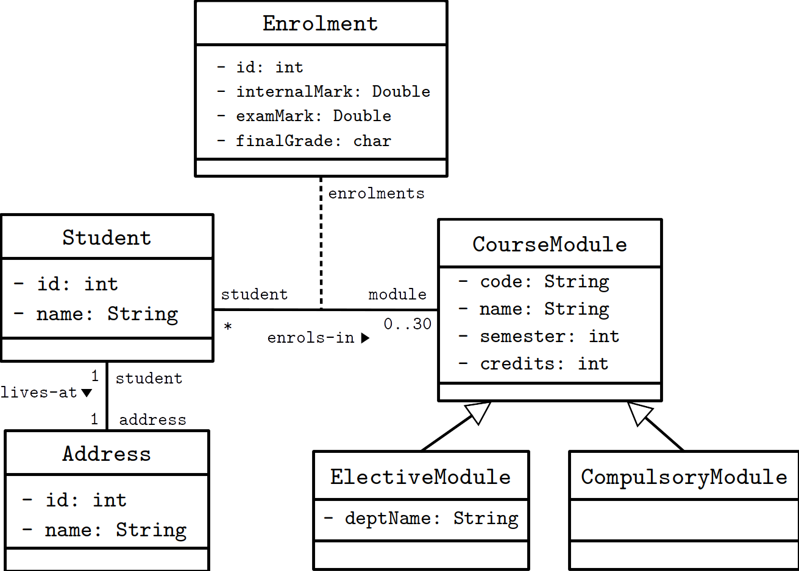
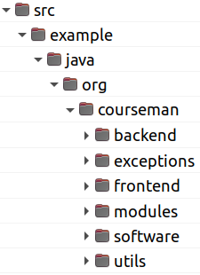

Generating RESTful Full Stack Software
=============


| Author | Version | Date 
| :--: | :--: | :--: |
| [Duc Minh Le](mailto:lemduc@gmail.com) | 1.0 | 05 Oct 2021 |
| Contributors: | Ha Thanh Vu, <br/> Binh Hai Do

# Technical report
[Full version](docs/jda-restful-report-full.pdf) of the paper submitted to the ICISN'22 conference.

# CourseMan Example
## Domain Model

<div align="center">Figure 1. The domain model of CourseMan.</div>

## Source code
[Source code zip file](dist/restfstool-example-courseman.zip)


<div align="center">Figure 2. The CourseMan source code directory structure.</div>

Note the following packages listed in Figure 2:
- `modules`: the domain model and associated MCCs, organised into modules
- `software`: the SCC and executable software
- `utils`: domain-specific utility classes
- `exceptions`: domain-specific exceptions
- `backend`: the pre-generated backend (in Spring Boot)
- `frontend`: the pre-generated frontend (in React.js)

# Binary distribution 
Binary distribution of module RESTFSTool as part of the JDA framework.

[Download link](https://drive.google.com/file/d/1crf_8Do-jR0Lkarai6pNef0BDr_XJwzA/view?usp=sharing)

## How to execute the generator functions

Assume current dir: `/tmp`
1. Extract the source code zip file to the current dir. This should create the source code dir path explained previously.
2. Delete the pre-generated `backend` and `frontend` packages 
3. Extract the binary distribution zip file to the current dir. This should create the following directory path: `dist/bin`
4. Execute the following command to generate the backend and frontend:
```
java -cp ./dist/bin com.hanu.courseman.software.CourseManRFSGenOnly

```
5. The generated source code are saved to the `backend` and `frontend` packages in the source code folder.
